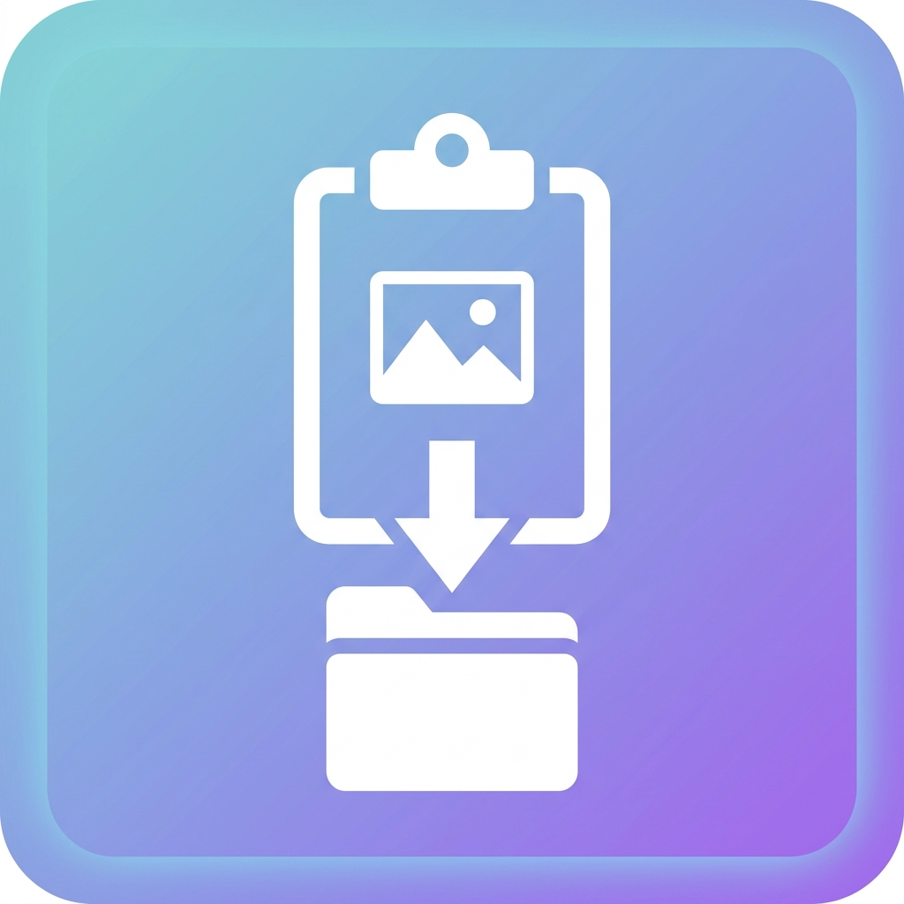

<p align="center">
  
</p>

<h1 align="center">PasteImageAsFile</h1>

<p align="center">
  <b>Вставляй картинки из буфера обмена прямо в Проводник или на Рабочий стол</b>
</p>

<p align="center">
  <a href="https://github.com/C0dece/PasteImageAsFile/releases/latest">
    
  </a>
  
  
  
  
</p>

---

## Что это?

Маленькая утилита для Windows, которая добавляет возможность вставлять скопированные изображения как файлы.

Скопировал картинку в браузере или сделал скриншот - нажал **Ctrl+V** в папке или на рабочем столе - получил файл. Все.

## Возможности

- **Ctrl+V в Проводнике** - мгновенная вставка изображений из буфера как `.png` файлов
- **Ctrl+V на Рабочем столе** - файл появляется точно под курсором мыши
- **Умное контекстное меню с иконкой программы**:
  - Пункт **"Вставить изображение из буфера"** появляется динамически только тогда, когда последнее скопированное это не картинка (текст, ссылка, документ). Позволяет в один клик достать и вставить последнюю скопированную картинку из памяти.
  - Если в буфере прямо сейчас картинка, пункт меню скрывается, чтобы не загромождать меню, ведь работает обычный `Ctrl+V`.
  - Пункт **"Буфер обмена"** вызывает системный журнал буфера обмена Windows (Win+V) с открытием прямо рядом с курсором мыши (настраивается в опциях).
  - Поддержка контекстного меню везде: в любой папке, на Рабочем столе и в корнях логических дисков (`C:\`, `D:\` и др.).
  - Опция включения **классического контекстного меню Windows 11**: убирает необходимость каждый раз нажимать "Показать дополнительные параметры" (Shift+F10).
- **Клик по значку в трее**:
  - В настройках можно включить вызов журнала буфера обмена Windows (Win+V) по простому клику левой кнопкой мыши на значок утилиты в трее.
- **Продвинутый буфер обмена в стиле Windows 11**:
  - Вкладки категорий: *Все*, *Снимки*, *Текст*, *Файлы*, *SuperHub*.
  - Поиск в реальном времени по содержимому и именам файлов.
  - Кастомный темный скроллбар Fluent Scrollbar без белых системных полос.
  - Два режима по клику: **Вставлять сразу (Ctrl+V)** в активное окно или **Только копировать в буфер**.
  - Двойной клик по картинке или файлу открывает его в программе по умолчанию.
  - Перетаскивание (Drag-and-Drop) карточки прямо на Рабочий стол или в папки.
- **Плавающая полка файлов SuperHub**:
  - Автоматически выдвигается при зажатии левой кнопки мыши у края экрана во время перетаскивания файлов.
  - Сплошная зона Drag-and-Drop: перетаскивайте любые файлы, картинки и текст прямо на полку.
  - Кнопка **[📦]** в шапке позволяет выгрузить все накопленные файлы одной операцией перетаскивания.
  - Переключатель режимов **[📋 Копия]** / **[✂️ Перенос]**: защита от случайного удаления файлов (по умолчанию режим Копирования).
  - Гибкое размещение: в углах или по сторонам экрана (справа/слева, сверху/по центру/снизу).
- **Поддержка тем оформления**:
  - Автоматическое определение системной темы Windows (Dark/Light) через реестр `AppsUseLightTheme` или принудительный выбор в настройках.
- **Продвинутое извлечение имени картинки**:
  - Извлекает оригинальные имена из HTML: атрибуты `src`, `data-original`, `data-src`, `data-url`, `srcset`, теги `alt`, `title`, `aria-label`, `<figcaption>`, OpenGraph теги и заголовки веб-страниц.
  - Умное определение окна источника: безошибочно определяет активное приложение даже при работе с несколькими мониторами.
  - Распознает прямые текстовые ссылки на изображения.
- **Вкладчатое окно настроек**:
  - Удобные разделы *Основные*, *Буфер обмена*, *SuperHub* с полным контролем над всеми функциями.
- **Полноформатная иконка** - качественный значок на .exe файле с поддержкой всех разрешений (до 256x256)
- **Легковесность** - компактный .exe файл, без сторонних зависимостей

## Установка

1. Скачай `PasteImageAsFile.exe` из [Releases](https://github.com/C0dece/PasteImageAsFile/releases/latest)
2. Запусти - откроется окно управления
3. Нажми **"Установить"** для интеграции с системой

Или через командную строку:
```
PasteImageAsFile.exe --install
```

## Удаление

В окне утилиты нажми **"Удалить из системы"**.

Или через командную строку:
```
PasteImageAsFile.exe --uninstall
```

## Как это работает

Утилита работает в фоне и отслеживает буфер обмена. Когда ты копируешь картинку (скриншот, из браузера, из редактора), она автоматически добавляет к данным буфера формат `FileDropList` - это тот формат, который Windows использует при копировании файлов.

Благодаря этому стандартная вставка Ctrl+V в Проводнике или на Рабочем столе сразу создает файл изображения. А если в буфере обмена сейчас находится другой контент, пункт контекстного меню "Вставить изображение из буфера" возьмет последнюю сохраненную картинку из локального кэша.

## Параметры запуска

| Параметр | Описание |
|----------|----------|
| *(без параметров)* | Открыть окно управления и настроек |
| `--daemon` / `-d` | Фоновый режим (иконка в трее) |
| `--install` / `-i` | Установить интеграцию в систему |
| `--uninstall` / `-u` | Удалить интеграцию из системы |
| `--history` / `-v` | Вызвать системный журнал буфера обмена (Win+V) у курсора |
| `--save <путь>` / `-s` | Сохранить картинку из буфера в указанную папку |

## Сборка из исходников

Для сборки нужен только встроенный компилятор .NET Framework:

```
build.bat
```

Готовый файл появится в `dist/PasteImageAsFile.exe`.

## Лицензия

[MIT](LICENSE)
